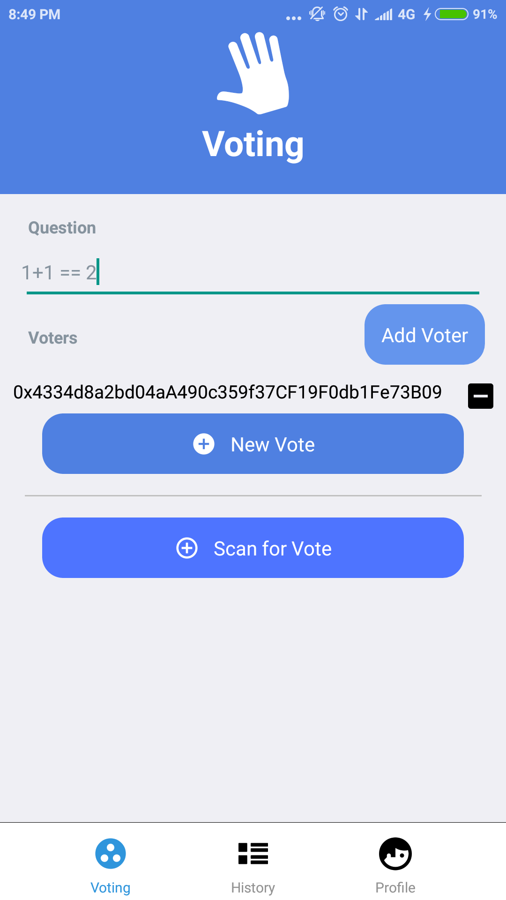

# Vkrypteia

Mobile Application for Voting on Ethereum Blockchain. This project is my senior project in faculty of engineering (computer engineering), Chulalongkorn university. The viedo explaination of the project is [here](https://www.youtube.com/watch?v=B5QwDulNNDg) (Thai langauge).

## Architecture
The mobile app is developed by a cross native platform (React Native) which can (Android, iOS) and it interacts directly to Ethereum blockchain for deploying a smart contract for
voting, casting the vote and tallying the result.

## Technologies

1. Mobile application
- The mobile app is developed by a cross native platform (`React Native`) which supports for both Android and iOS.

    

- `Web3` is a library with Javascript APIs for connecting to Ethereum blockchain.

    

2. Blockchain
- The selected blockchain is `Ethereum` since its majority on smart contract platform with `Solidity` language which is Javascirpt-like language for developing smart contract application on Ethereum. Since all operations for interacting to Ethereum blockchain cost Gas, the network used for the project is in testnet (`Rinkeby`) which we can request a faucet for Ether.

    
    

## Usage

Here is a sequence diagram for this project.

    

1. <b>[Admin]</b> fills the question for the vote and scan QR code of voters that will be voting, then there will be QR code for voters to join the vote.

    
        

    
    

2. <b>[Voters]</b> register for the vote by scanning QR code generated by Admin.

    
    

3. <b>[Voters]</b> cast their vote for the question.

    

4. After every voters have submitted their vote, the results will be automatically tallied and shown on the application screen.

    

