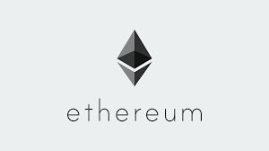

# Vkrypteia

Mobile Application for voting on Ethereum blockchain. This project is my senior project in faculty of engineering (computer), Chulalongkorn university.

## Architecture
The mobile app is developed by a cross native platform (React Native) which can (Android, iOS) and it interacts directly to Ethereum blockchain for deploying a smart contract for
voting, casting the vote and tallying the result.

## Technologies

1. Mobile application
- The mobile app is developed by a cross native platform (`React Native`) which supports for both Android and iOS.

- `Web3` is a library with Javascript APIs for connecting to Ethereum blockchain.

2. Blockchain
- The selected blockchain is `Ethereum` since its majority on smart contract platform that is ... with .Since all operations for interacting to Ethereum blockchain cost Gas, the network used for the project is in testnet (`Rinkeby`) which we can request a faucet for Ether.

## Usage

<!-- Can refer to [Documentation](DOC.md) -->
1. <b>[Admin]</b> fdf

